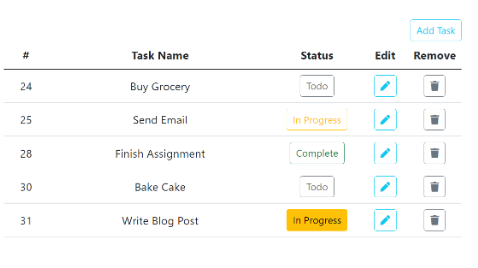

# YZL 8408 - Class Project - Todolist App

## İsterler

- Bir Todolist uygulmasının oluşturulması.

## İşlevsellik

- Todo ekleme komponentinin olması beklenmektedir.
- Eklenen todo' lar listelenebilmelidir.
- Her todo tekrardan güncellenebilmelidir.
- Todo' lar silinebilmelidir.
- Todo' lar silinmeden önce kullanıcıya mutlaka "Emin Misiniz?" şeklinde bir onay penceresi gösterilmeli, kullanıcıdan onay alındıktan sonra silinmelidir.

## Tasarım



## İzlenecek Adımlar

- Planlama
- Tasarım
- Kodlama
- Test
- Deploy

## Uzak Servis Bilgileri
### https://todo-service-app-fdc3149b656f.herokuapp.com/todos       
[GET]       Tüm todo' ları getir.
### https://todo-service-app-fdc3149b656f.herokuapp.com/todos/1     
[GET]       Tek bir todo' yu getir. Id' ye göre. 1=id
### https://todo-service-app-fdc3149b656f.herokuapp.com/todos       
[POST]      Todo oluşturur. 
#### Payload
```json
{
    "id": 1,
    "title": "Toodo 2",
    "completed": false,
    "description": "This is a description"
}
```
### https://todo-service-app-fdc3149b656f.herokuapp.com/todos/1      
[PUT]      Todo günceller. Id' ye göre. 1=id
#### Payload
```json
{
    "id": 1,
    "title": "Toodo 2",
    "completed": false,
    "description": "This is a description"
}
```
### https://todo-service-app-fdc3149b656f.herokuapp.com/todos/1     
[DELETE]    Tek bir todo' yu siler. Id' ye göre. 1=id
